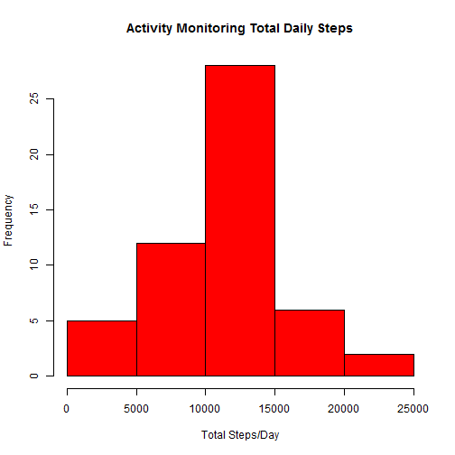
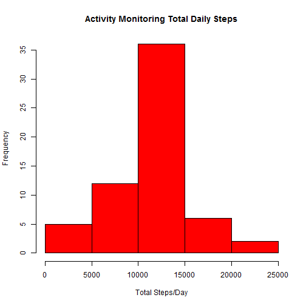
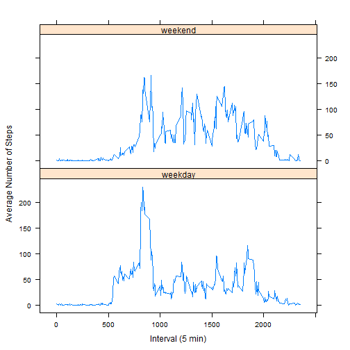

# Course Project 1


## Loading and Preprocessing of the Dataset


```r
activity <- read.csv("activity.csv")
activity$date <- as.Date(activity$date, "%Y-%m-%d")
```

## Question:  What is the mean total number of steps taken per day?

1. Total number of steps taken per day

```r
TSD <- aggregate(steps~date, data=activity, sum)
```

2. Histogram of the total number of steps taken per day

```r
hist(TSD$steps, xlab = "Total Steps/Day", ylab = "Frequency", 
     main = "Activity Monitoring Total Daily Steps", col = "red")
```



3. Mean and Median of the total number of steps taken per day

```r
mean(TSD[[2]])
```

```
## [1] 10766.19
```

```r
median(TSD[[2]])
```

```
## [1] 10765
```

## Question:  What is the average daily activity pattern?

1. Time Series Plot

```r
ADAP<-aggregate(steps~interval, data=activity, mean)
library(ggplot2)
g <- ggplot(ADAP, aes(x = interval, y = steps))
g + geom_line() + labs(title = "Average Daily Activity Pattern") + 
      labs(x = "Interval (5 min)") + 
      labs(y = "Average Daily Steps per Interval") + 
      theme(plot.title = element_text(hjust = 0.5))
```


2. Interval with maximum number of average steps

```r
ADAP[match(max(ADAP[[2]]),ADAP$steps),1]
```

```
## [1] 835
```

## Input Missing Values

1. Total number of missing values in the dataset

```r
sum(is.na(activity$steps))
```

```
## [1] 2304
```

2. Devise a strategy to fill NA values  
      - Use 5 minute interval mean value to replace missing (NA) values

3. Create new dataset equal to the original with NA values filled in

```r
actfill<-activity
for (i in seq_len(nrow(actfill))) {
      if (is.na(actfill[i,1]) == TRUE) {
            actfill[i,1] <- ADAP[match(actfill[i,3],ADAP$interval),2]
      }
}
sum(is.na(actfill$steps))
```

```
## [1] 0
```

4. Histogram of the total number of steps per day, mean and median total number
of steps taken per day.

```r
TSDactfill <- aggregate(steps~date, data=actfill, sum)
hist(TSDactfill$steps, xlab = "Total Steps/Day", ylab = "Frequency", 
     main = "Activity Monitoring Total Daily Steps", col = "red")
```



```r
mean(TSDactfill[[2]])
```

```
## [1] 10766.19
```

```r
median(TSDactfill[[2]])
```

```
## [1] 10766.19
```

- The mean value remained the same when compared to the original data, however the median increased to 10766 from 10765 for the original dataset
- The impact on the estimates of the total daily number of steps is an increase of data at or near the mean value due to the missing values being replaced with the average for the specified time interval.  The result is a shift in the median value towards the mean value.

## Question: Are there differences in activity patterns between weekdays and weekends?

1. Create a new factor variable with two levels "weekday" and "weekend" and add to the dataset

```r
actfill["day.class"]<-NA
for (i in seq_len(nrow(actfill))) {
      if (weekdays(actfill[i,2]) == "Saturday" | weekdays(actfill[i,2]) == "Sunday") {
            actfill[i,4] = "weekend"
      }
      else { actfill[i,4] = "weekday"}
}
actfill$day.class<-factor(actfill$day.class)
```

2. Make a panel plot of interval vs average steps across either weekday or weekend

```r
avgsteps <- aggregate(steps~interval * day.class, data=actfill, mean)
library(lattice)
xyplot(steps ~ interval | day.class, data = avgsteps, layout = c(1,2), 
       type = "l", xlab = "Interval (5 min)", 
       ylab = "Average Number of Steps")
```


